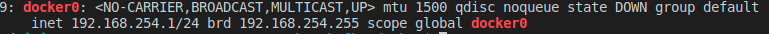

# Prefect - Docker Compose

A simple guide to understand and make Prefect work with your own docker-compose configuration.

This allows you to package your Prefect instance for Kubernetes or offline use.


- [Prefect - Docker Compose](#prefect---docker-compose)
  - [Run the server](#run-the-server)
  - [Run one or multiple agents](#run-one-or-multiple-agents)
  - [Run your first flow via the Prefect API](#run-your-first-flow-via-the-prefect-api)
    - [Principles to understand](#principles-to-understand)
    - [Flow with Local storage (easiest)](#flow-with-local-storage-easiest)
    - [Flow with S3 Storage](#flow-with-s3-storage)
    - [Flow with Docker storage](#flow-with-docker-storage)
      - [Preparing the Registry](#preparing-the-registry)
      - [Start the Docker in Docker agents](#start-the-docker-in-docker-agents)
      - [Registering the flow](#registering-the-flow)

## Run the server

Open and edit the [`server/.env`](./server/.env) file.  
All `PREFECT_SERVER_*` options are [explained in the official documentation](https://docs.prefect.io/core/concepts/configuration.html#environment-variables) and [listed in the `config.toml` file](https://github.com/PrefectHQ/prefect/blob/master/src/prefect/config.toml).

Then you can run :

```bash
docker-compose -f server/docker-compose.yml up -d
```

Insert the following content in file `~/.prefect/config.toml` :

```conf
# ~/.prefect/config.toml
debug = true

# base configuration directory (typically you won't change this!)
home_dir = "~/.prefect"

backend = "server"

[server]
host = "http://172.17.0.1"
port = "4200"
host_port = "4200"
endpoint = "${server.host}:${server.port}"
```

Finally, we need to create a _tenant_. Execute on your host :

```bash
pip3 install prefect
prefect backend server
prefect server create-tenant --name default --slug default
```

Access the UI at [localhost:8080](http://localhost:8080)

## Run one or multiple agents

Agents are services that run your scheduled flows.

Open and edit the [`agent/config.toml`](./agent/config.toml) file.

> :information_source: In each `config.toml`, you will find the `172.17.0.1` IP address. This is the IP of the Docker daemon on which are exposed all exposed ports of your containers. This allows containers launched from different docker-compose networks to communicate. Change it if yours is different (check your daemon IP by typing `ip a | grep docker0`).
> 
> 
> 
> Here, mine is `192.168.254.1` but the default is generally to `172.17.0.1`.

Then you can run :

```bash
docker-compose -f agent/docker-compose.yml up -d
```


  ```bash
  docker-compose -f ./client_docker/docker-compose.yml up weather
  ```

Now your flow is registered. You can access the UI to run it.

</details>
