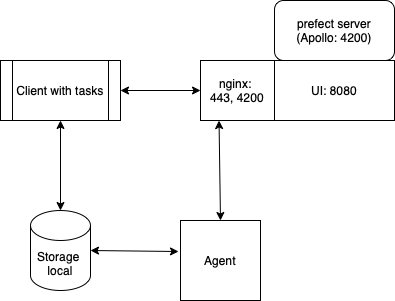

# Prefect - Docker Compose

A simple guide to understand and make Prefect work with your own docker-compose configuration.

This allows you to package your Prefect instance for Kubernetes or offline use.



- [Prefect - Docker Compose](#prefect---docker-compose)
  - [Run the server](#run-the-server)


## Run the server

Open and edit the [`server/.env`](./server/.env) file.  
All `PREFECT_SERVER_*` options are [explained in the official documentation](https://docs.prefect.io/core/concepts/configuration.html#environment-variables) and [listed in the `config.toml` file](https://github.com/PrefectHQ/prefect/blob/master/src/prefect/config.toml).

Then you can run :

```bash
docker-compose -f server/docker-compose.yml up -d
```
You can login https://localhost with username=testuser, password=testpw for authentication before access into UI of Apollo

